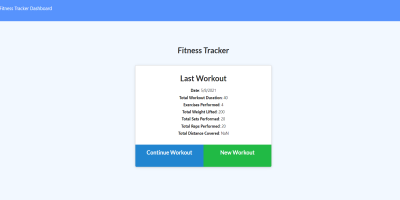

## FITNESS TRACKER

# Screenshot of App

## DESCRIPTION

Need an app where you can view past workouts, edit your workouts, or keep track of your current workout? This app can do just that.
Using a MongoDB database and Express, users can create and save their workouts, and can come back at a later time to view their previous workouts and view statistics based on their past workouts.

This app can be viewed at: https://immense-peak-85651.herokuapp.com/.

## TABLE OF CONTENTS

- [Description](#description)
- [Installation](#Installation)
- [License](#License)
- [Usage](#Usage)
- [Credits](#Credits)
- [Contributing](#Contributing)
- [Tests](#Tests)
- [Questions](#Questions)

## INSTALLATION

To install the dependencies necessary for this project, run the following command:

- npm i

## LICENSE

- This project is licensed under the MIT license.

## USAGE

- This project requires Requires node v14+ to run.

## Credits

## CONTRIBUTING

- Pull requests are welcome. For major changes, please open an issue first to discuss what you would like to change.
- Please make sure to update tests as appropriate.

## TESTS

- npm test

## QUESTIONS

- If you have any questions, I can be reached through me email at slevalley@gmail.com. My GitHub profile can be viewed at at
  [sjlevalley](https://www.github.com/sjlevalley).
